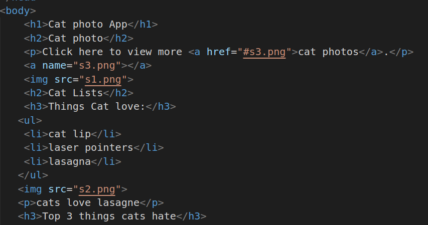
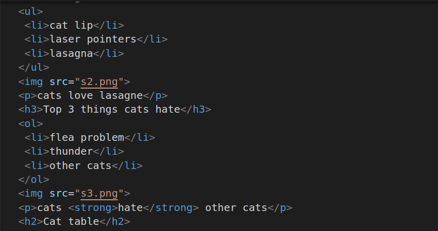
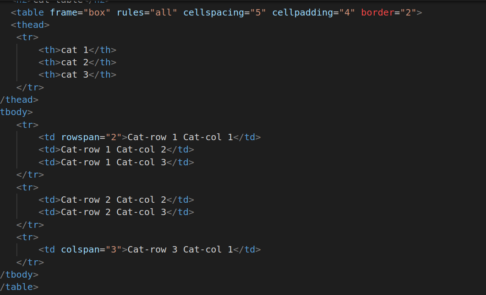
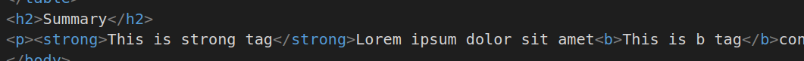
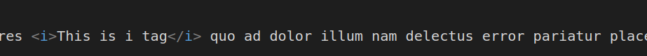
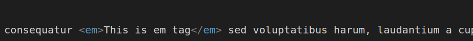

# The Cat Photo App
1.
##### Explanation
* h1 tag is used for main heading
* h2 tag is used for second heading
* a is anchor tag and href is used for determining destination for source
* img tag used to show image on browser using source link
* ul list lists all items unorder
* p tag is used for paragraph

2.
##### Explanation
* ol is ordered list it lists all ietms in oreder
* strong tag used to highlight the specific content

3.
##### Explanation
* table tag is container for creating a table structure. It holds all the rows, cells, headers, and other table-related elements. It has various attributes to control table properties, such as border, cellspacing, cellpadding, etc.
* thead Stands for "table header." It groups the header content in a table. Typically, it contains one or moretable row elements that hold table header cell elements.
* tr Stands for "table row." It represents a row in the table. It contains one or more 
* th Stands for "table header." It represents a header cell in the table.
* border Specifies the width of the border around the table. It takes a numerical value. 
* cellspacing Specifies the space between adjacent cells. It takes a numerical value in pixels.
* cellpadding Specifies the space within each cell to create padding. It takes a numerical value in pixels.
* frame Specifies which sides of the table should be surrounded by a border
* rules Specifies whether to display inner and outer borders in the table. Values can include "none," "groups," "rows," "cols," or "all."
* rospan Specifies the number of rows a cell should span.
* colspan  Specifies the number of columns a cell should span. 

4.
##### Explanation
* b tag is used to show the content in bold 
* strong is used for haighlight the content 

5.
##### Explanation
* i tag used to show contnet in italic

6.
##### Explanation
*em tag is used to show content in italic format.